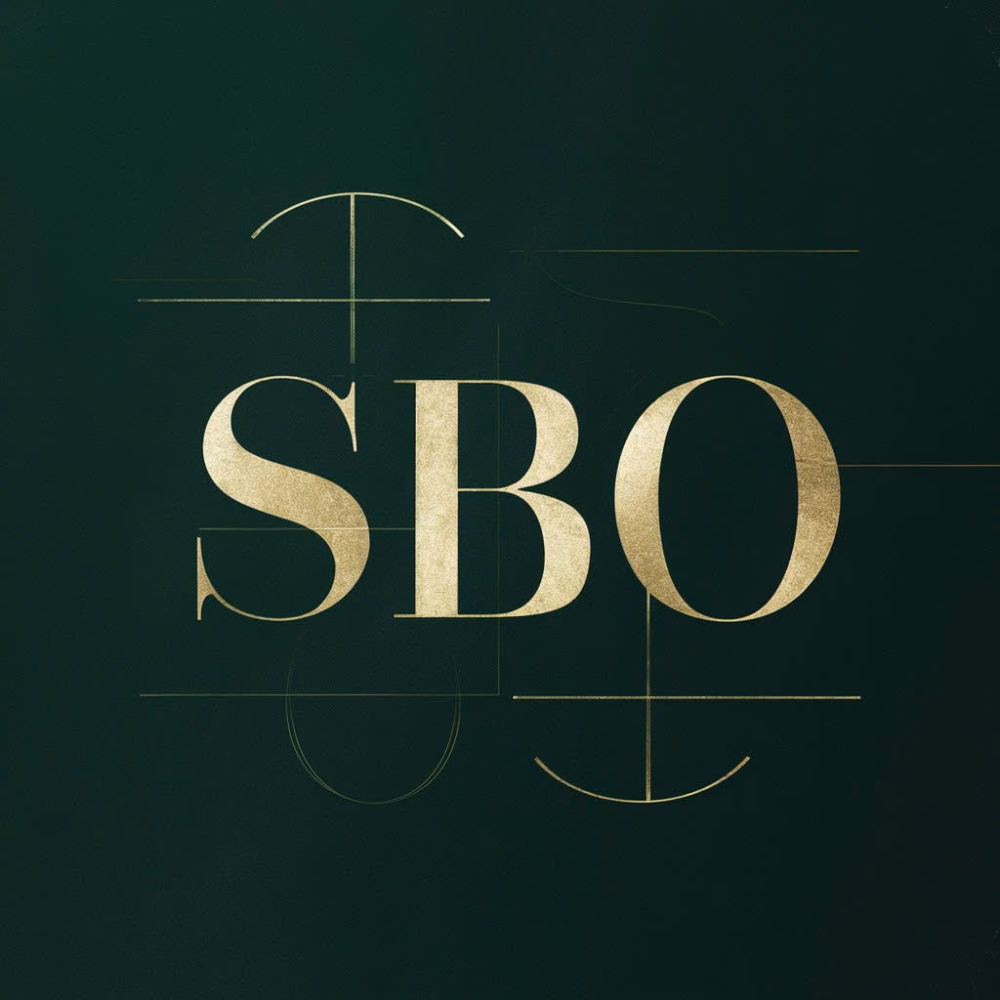

# Portfolio Website - Nguyễn Minh Toàn



🔗 **Live Demo**: [https://minhtoanportfolio.vercel.app/](https://minhtoanportfolio.vercel.app/)

## 📝 Giới thiệu

Portfolio website cá nhân được xây dựng với Next.js 15, TypeScript và Tailwind CSS. Trang web giới thiệu về bản thân, các dự án và kỹ năng của tôi với giao diện hiện đại, animations mượt mà và responsive hoàn toàn.

## 🚀 Công nghệ sử dụng

- **Framework**: [Next.js 15.1.7](https://nextjs.org/) - React framework với App Router
- **Language**: [TypeScript 5](https://www.typescriptlang.org/) - Type safety
- **Styling**: [Tailwind CSS 4](https://tailwindcss.com/) - Utility-first CSS
- **Animations**: [Framer Motion](https://www.framer.com/motion/) - Smooth animations
- **Forms**: [React Hook Form](https://react-hook-form.com/) - Form validation
- **Icons**: [Lucide React](https://lucide.dev/) - Beautiful icons
- **Email Service**: [EmailJS](https://www.emailjs.com/) - Contact form integration
- **Deployment**: [Vercel](https://vercel.com/) - Hosting platform

## ✨ Tính năng chính

-  **Responsive Design**: Hoạt động mượt mà trên mọi thiết bị (Desktop, Tablet, Mobile)
-  **Smooth Animations**: Hiệu ứng chuyển động đẹp mắt với Framer Motion
-  **Dynamic Content**: Dữ liệu được quản lý tập trung trong `portfolio.ts`
-  **Contact Form**: Tích hợp EmailJS để gửi email trực tiếp
-  **SEO Optimized**: Metadata và OpenGraph tags được cấu hình đầy đủ
-  **TypeScript**: Type-safe code với TypeScript
-  **Modern UI/UX**: Giao diện hiện đại, thân thiện người dùng
-  **Performance**: Tối ưu hóa tốc độ tải trang và rendering

## 🛠️ Cài đặt và Chạy

### Yêu cầu hệ thống

- Node.js 20.x hoặc cao hơn
- npm hoặc yarn

### Bước 1: Clone repository

```bash
git clone https://github.com/MinhToan4/portfolio.git
cd portfolio
```

### Bước 2: Cài đặt dependencies

```bash
npm install
```

### Bước 3: Chạy development server

```bash
npm run dev
```

Mở [http://localhost:3000](http://localhost:3000) để xem kết quả.

### Bước 4: Build production

```bash
npm run build
npm start
```

## 📁 Cấu trúc dự án

```
portfolio/
├── public/                 # Static assets
│   ├── images/            # Project images
│   └── cv.md              # CV content
├── src/
│   ├── app/               # Next.js App Router
│   │   ├── globals.css    # Global styles
│   │   ├── layout.tsx     # Root layout
│   │   └── page.tsx       # Homepage
│   ├── components/        # React components
│   │   ├── About.tsx      # About section
│   │   ├── Contact.tsx    # Contact form
│   │   ├── Experience.tsx # Work experience
│   │   ├── Footer.tsx     # Footer
│   │   ├── Header.tsx     # Navigation
│   │   ├── Hero.tsx       # Hero section
│   │   ├── Projects.tsx   # Projects showcase
│   │   └── Skills.tsx     # Skills display
│   ├── data/
│   │   └── portfolio.ts   # Portfolio data (update this!)
│   └── lib/
│       └── utils.ts       # Utility functions
├── eslint.config.mjs      # ESLint config
├── next.config.ts         # Next.js config
├── tailwind.config.ts     # Tailwind config
└── tsconfig.json          # TypeScript config
```

## 🎨 Tùy chỉnh
## 🎨 Tùy chỉnh

### Cập nhật thông tin cá nhân

Chỉnh sửa file `src/data/portfolio.ts` để cập nhật:
- Thông tin cá nhân (tên, email, số điện thoại, địa chỉ)
- Kỹ năng và mức độ thành thạo
- Dự án và mô tả
- Kinh nghiệm làm việc
- Social media links

### Thay đổi giao diện

- **Colors**: Chỉnh sửa `tailwind.config.ts` để thay đổi màu sắc chủ đạo
- **Fonts**: Cập nhật trong `src/app/layout.tsx`
- **Styles**: Chỉnh sửa `src/app/globals.css` cho global styles

## 🚀 Deployment

### Deploy lên Vercel (Khuyến nghị)

1. Push code lên GitHub
2. Truy cập [Vercel](https://vercel.com/)
3. Import repository
4. Configure environment variables (nếu cần)
5. Deploy!

Vercel sẽ tự động deploy lại khi có commit mới.

## 📊 Performance

- ⚡ **Fast Loading**: Static generation với Next.js
- 🎯 **SEO Friendly**: Optimized meta tags
- 📱 **Mobile First**: Responsive design
- ♿ **Accessible**: Semantic HTML và ARIA labels

## 🔧 Scripts

```bash
npm run dev       # Chạy development server với Turbopack
npm run build     # Build production
npm run start     # Chạy production server
npm run lint      # Kiểm tra code với ESLint
```

## 📝 License

© 2026 Nguyễn Minh Toàn. All rights reserved.

---

⭐ Nếu bạn thấy dự án này hữu ích, hãy cho nó một star trên GitHub!

